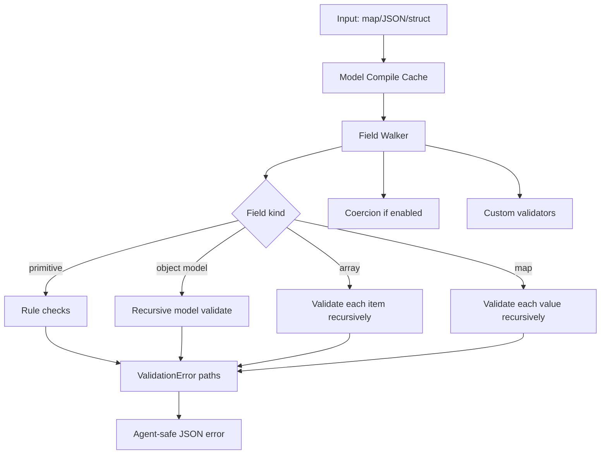

# go-pydantic-port

[](https://go.dev/)
[](LICENSE)
[](https://github.com/njchilds90/go-pydantic-port/actions/workflows/ci.yml)
[](#performance)
[](https://goreportcard.com/report/github.com/njchilds90/go-pydantic-port)

Runtime validation + JSON Schema for the Go AI stack: **goragkit -> go-ruler -> go-pydantic-port**.

## Highlights

- Fluent models + typed struct validation
- Nested object/array/map validation
- Model-scoped and global custom validators
- Strict-by-default with optional field/global coercion
- JSON Schema generation with nested `$defs`

## Quickstart

```go
address := pydantic.NewModel("Address").
  Field("city", "string", "required").End()

user := pydantic.NewModel("User").
  Field("address", address, "required").End()

err := pydantic.ValidateMap(ctx, user, map[string]any{
  "address": map[string]any{"city": "Austin"},
})
```

## Custom validators

```go
m := pydantic.NewModel("EmailInput").
  AddValidator("is_email", func(_ context.Context, v any) error {
    s := fmt.Sprintf("%v", v)
    if !strings.Contains(s, "@") { return fmt.Errorf("invalid email") }
    return nil
  }).
  Field("email", "string", "required").Custom("is_email").End()
```

## Coercion + strict mode

```go
m := pydantic.NewModel("Payload").
  SetStrictMode(false).
  Field("age", "integer", "required").Coerce().End()
```

## Architecture



## Performance

`go test -bench=. -run=^$ ./...` (local CI-like runner):

- `BenchmarkValidateSimpleMap`: ~129 ns/op
- `BenchmarkValidateNestedMap`: ~430 ns/op
- `BenchmarkValidateCoercionPath`: ~220 ns/op

## CLI

```bash
pydantic validate --model model.json --input payload.json
pydantic schema --model model.json
pydantic serve --model model.json --addr :8080
```
