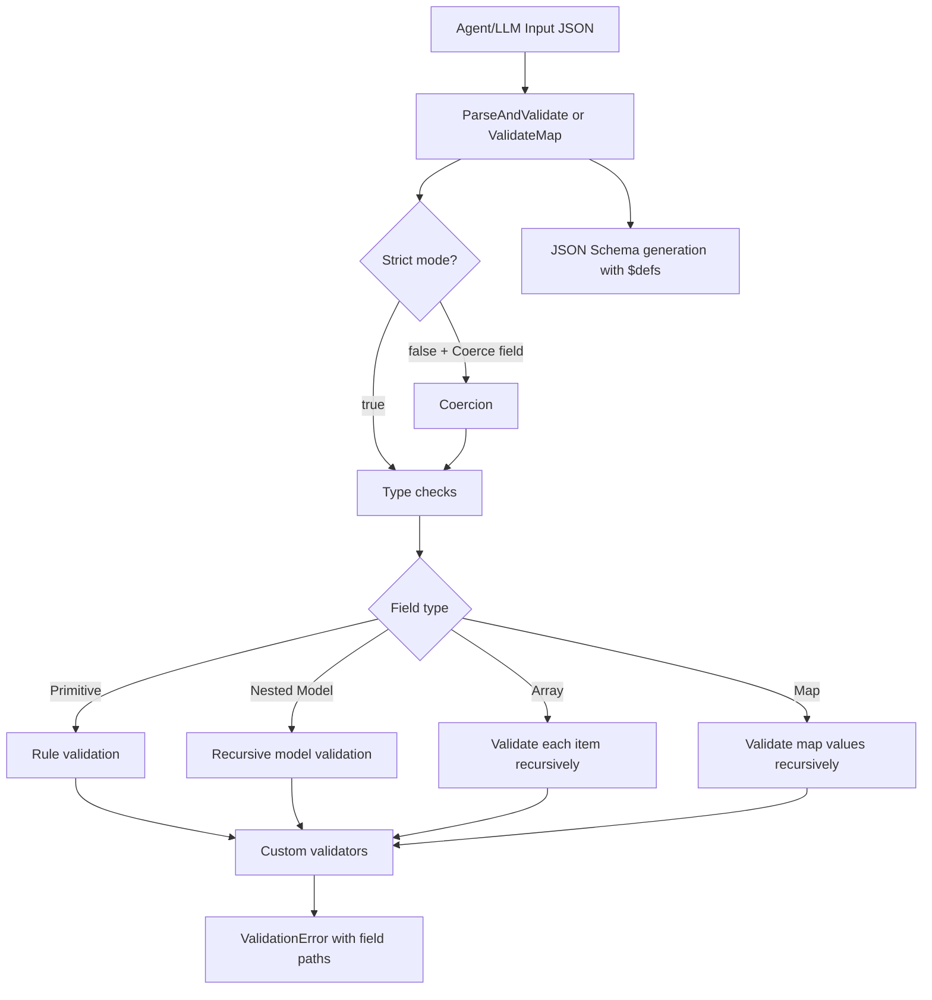

# go-pydantic-port

[](https://go.dev/)
[](LICENSE)
[](https://github.com/njchilds90/go-pydantic-port/actions/workflows/ci.yml)
[](#performance)
[](https://pkg.go.dev/github.com/njchilds90/go-pydantic-port)

**The Go AI stack, completed:**
- **goragkit** for retrieval and context assembly
- **go-ruler** for deterministic policy/decisioning
- **go-pydantic-port** for structured outputs, coercion-safe parsing, and runtime validation

`go-pydantic-port` is a zero-dependency runtime validation + JSON Schema library for Go apps and autonomous agents. It is strict by default, supports nested models, typed structs, fluent map validation, and agent-friendly error payloads.

## Installation

```bash
go get github.com/njchilds90/go-pydantic-port@v0.3.0
```

## Quickstart

### 1) Fluent builder (dynamic payloads)

```go
address := pydantic.NewModel("Address").
  Field("city", "string", "required").End().
  Field("zip", "string", "required").End()

order := pydantic.NewModel("Order").
  Field("address", address, "required").End().
  Field("items", "array", "items=string", "required").End().
  Field("metadata", "object").MapValues("string").End()

err := pydantic.ValidateMap(ctx, order, map[string]any{
  "address": map[string]any{"city": "Austin", "zip": "78701"},
  "items": []any{"cpu", "ram"},
  "metadata": map[string]any{"trace_id": "abc-123"},
})
if err != nil {
  panic(err)
}
```

### 2) Typed struct parsing (LLM structured output)

```go
type Extraction struct {
  Answer string `json:"answer" validate:"required,min=3"`
  Score  int    `json:"score" validate:"min=0,max=100"`
}

out, err := pydantic.ParseAndValidate[Extraction](ctx, llmJSON)
if err != nil {
  panic(err)
}
_ = out
```

## Custom validators

```go
model := pydantic.NewModel("EmailInput").
  AddCustomValidator("is_email", func(v any) error {
    s := fmt.Sprintf("%v", v)
    if !strings.Contains(s, "@") {
      return fmt.Errorf("invalid email format")
    }
    return nil
  }).
  Field("email", "string", "required", "custom=is_email").End()

err := pydantic.ValidateMap(ctx, model, map[string]any{"email": "foo@example.com"})
```

## Coercion + strict mode

Strict mode is on by default. For controlled coercion paths (common with LLM payloads), disable strict mode and opt-in on specific fields:

```go
m := pydantic.NewModel("Payload").
  WithStrictMode(false).
  Field("age", "integer", "required").Coerce().End()

// "21" => 21 before numeric validation
err := pydantic.ValidateMap(ctx, m, map[string]any{"age": "21"})
```

## CLI

```bash
pydantic validate --model model.json --input payload.json
pydantic schema --model model.json
pydantic serve --model model.json --addr :8080
```

## How agents use this

1. **Tool calling validation**: generate schema from `Model.Schema()` and attach to tool definitions.
2. **RAG output parsing**: validate goragkit-returned maps before memory writes.
3. **Decision guardrails**: validate payload then pass to go-ruler.
4. **Retry loops**: return machine-readable `ValidationError` with field paths.

### AI-agent examples

#### Validate tool-call payloads

```go
toolModel := pydantic.NewModel("ToolCall").
  Field("tool", "string", "required").End().
  Field("args", "object", "required").End()

if err := pydantic.ValidateMap(ctx, toolModel, payload); err != nil {
  // send err JSON back to agent planner
}
```

#### Parse goragkit result into typed model

```go
out, err := goragkit.ParseResult[Extraction](ctx, rawJSON)
```

#### Validate then decide with go-ruler

```go
ok, err := goruler.ValidateThenEvaluateWithRuler(ctx, orderModel, input, rulesEngine)
```

#### Use schema in prompts

```go
schema := order.Schema()
prompt := fmt.Sprintf("Return valid JSON matching this schema: %v", schema)
```

## Architecture



## Performance

From `go test -bench=. -run=^$ ./...`:

- `BenchmarkValidateSimpleMap`: **~120 ns/op**
- `BenchmarkValidateNestedMap`: **~462 ns/op**
- `BenchmarkValidateCoercionPath`: **~161 ns/op**

## Roadmap

- Custom error templating per-field
- OpenAPI component export
- Optional code generation for static validators

## Ecosystem

- [goragkit](https://github.com/njchilds90/goragkit)
- [go-ruler](https://github.com/njchilds90/go-ruler)
- [goretry](https://github.com/njchilds90/goretry)
- [go-result](https://github.com/njchilds90/go-result)

## GoDoc

- https://pkg.go.dev/github.com/njchilds90/go-pydantic-port
